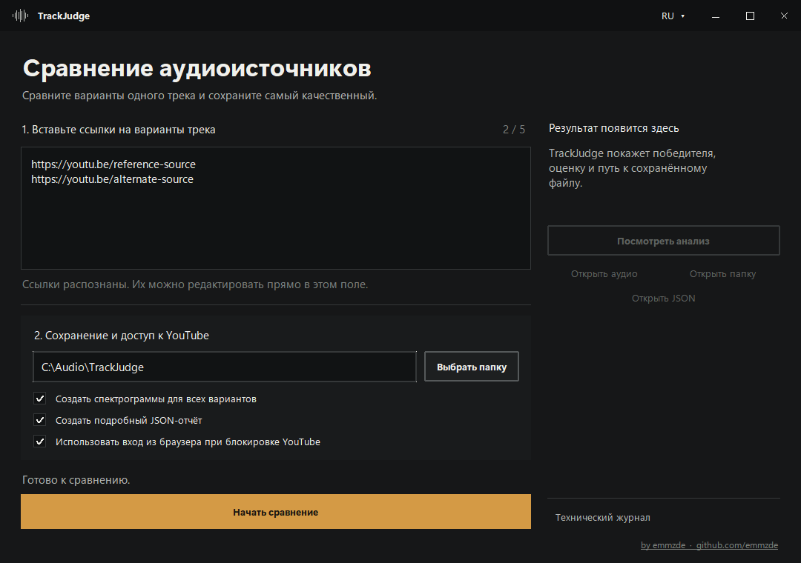

# TrackJudge

[**English**](README.md) | [Русский](README.ru.md)

[](https://github.com/emmzde/track-judge/releases/latest)
[](https://github.com/emmzde/track-judge/releases/latest)
[](https://www.python.org/)
[](https://github.com/emmzde/track-judge/actions/workflows/ci.yml)

TrackJudge is a Windows desktop application that downloads up to five versions
of the same track, evaluates their audio quality, and keeps the best candidate.
An optional command-line mode is included for automation and development.



## What it does

- Accepts up to five YouTube or other supported media links.
- Downloads the best available audio stream through `yt-dlp`.
- Compares codec metadata, bitrate, spectral cutoff, high-frequency structure,
  and stereo correlation.
- Detects suspicious upscales and stationary high-frequency noise.
- Saves the winner without re-encoding whenever possible.
- Generates an optional JSON report and spectrograms for every candidate.
- Includes Russian, English, and German interface languages.
- Keeps `yt-dlp` current automatically and rolls back a broken update.

> TrackJudge is a comparison heuristic, not forensic proof of audio provenance.
> It works best with different sources of the same recording and master.

## Download

### Windows installer — recommended

[Download TrackJudge Setup](https://github.com/emmzde/track-judge/releases/latest/download/TrackJudge-Setup-Windows-x64.exe)

Run the installer once. It installs TrackJudge for the current Windows user and
creates shortcuts on the desktop and in the Start menu. Python, FFmpeg,
FFprobe, `yt-dlp`, and all required libraries are included.

Before an online comparison, TrackJudge checks for a current `yt-dlp` build.
Updates are stored under the current Windows user's local app data, verified by
the official updater, and never overwrite the bundled fallback copy. If a new
build cannot download any source, TrackJudge restores the previous working
version and retries.

### Portable version

[Download the portable ZIP](https://github.com/emmzde/track-judge/releases/latest/download/TrackJudge-Windows-x64.zip)

Extract the archive and launch `TrackJudge.exe`. The portable build does not
create shortcuts or modify `PATH`. Its automatically updated `yt-dlp` runtime
copy is stored in the current Windows user's local app data.

Unsigned builds can trigger a Windows SmartScreen warning. SHA-256 checksum
files are attached to every release.

## Using the app

1. Paste one to five links for different versions of the same track.
2. Choose where the winning audio file should be saved.
3. Select whether to create spectrograms and a JSON report.
4. Click **Start comparison**.
5. Review the result, detailed scores, warnings, and spectrograms.

Temporary reports and spectrograms are cleaned up when the app closes unless
you explicitly save a copy.

## Developer setup

```bash
git clone https://github.com/emmzde/track-judge.git
cd track-judge
python -m venv .venv
```

Activate the environment:

```powershell
# Windows PowerShell
.\.venv\Scripts\Activate.ps1
```

```bash
# Linux or macOS
source .venv/bin/activate
```

Install the project with development and spectrogram dependencies:

```bash
python -m pip install --upgrade pip
python -m pip install -e ".[dev]"
```

FFmpeg and FFprobe must be available on `PATH` when running from source.

Launch the GUI:

```bash
trackjudge-gui
```

Run the test suite:

```bash
ruff check .
ruff format --check .
pytest
```

## Optional command-line mode

Compare online sources:

```bash
trackjudge "URL_1" "URL_2" "URL_3"
```

Compare local audio files:

```bash
trackjudge ./candidate-a.flac ./candidate-b.m4a
```

Save a spectrogram and JSON report:

```bash
trackjudge "URL_1" "URL_2" \
  --spectrogram \
  --json-report \
  --output ./results
```

Run `trackjudge --help` to see every option.

## How the ranking works

For each candidate TrackJudge:

1. extracts up to five minutes from the center of the track;
2. normalizes the analysis stream to at most two channels and 48 kHz;
3. computes an STFT-based median power spectrum;
4. estimates the effective and raw spectral cutoff;
5. measures modulation and correlation in the high-frequency probe band;
6. applies reliability checks and ranks all valid candidates.

The JSON report records codec metadata, duration, cutoff measurements,
authenticity score, warnings, and output paths.

## Build a Windows release

```powershell
.\scripts\build-portable.ps1
.\scripts\build-installer.ps1
```

The build uses pinned and checksum-verified `yt-dlp` and FFmpeg releases,
performs GUI and audio smoke tests, and produces:

- `dist/TrackJudge-Windows-x64.zip`
- `dist/TrackJudge-Setup-Windows-x64.exe`
- matching SHA-256 files

Pushing a `v*` Git tag runs the same release pipeline through GitHub Actions.
The repository also runs a weekly YouTube extraction smoke test and receives
weekly dependency update proposals through Dependabot.

## Legal and security notes

Only download media that you are authorized to access and store. Browser
cookies are used only after an anti-bot response and are never saved by
TrackJudge. Common cookie filenames and generated media are excluded by
`.gitignore`.

Third-party components and their licenses are documented in
[THIRD_PARTY_NOTICES.md](THIRD_PARTY_NOTICES.md). Portable builds include the
notices shipped with the bundled FFmpeg distribution.

Automatic `yt-dlp` updates use the official nightly channel. Set
`TRACKJUDGE_DISABLE_YTDLP_UPDATE=1` before launching the app to disable them,
or set `TRACKJUDGE_YTDLP_CHANNEL=stable` to stay on stable releases.

## License

TrackJudge is released under the [MIT License](LICENSE).

Created by [emmzde](https://github.com/emmzde).
