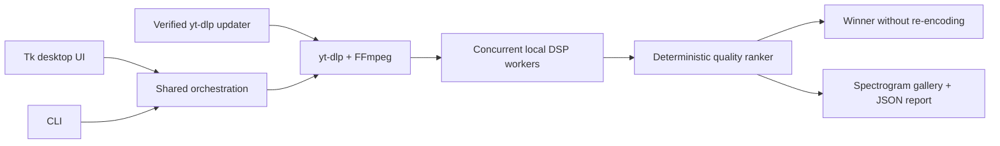

# TrackJudge

**TrackJudge downloads up to five releases of the same track with `yt-dlp`, compares them locally by spectrum, and saves the strongest source without re-encoding whenever possible.**


[](https://github.com/emmzde/track-judge/releases/latest)
[](https://github.com/emmzde/track-judge/actions/workflows/ci.yml)
[](https://www.python.org/)
[](https://github.com/emmzde/track-judge/releases/latest)
[](LICENSE)

[**English**](README.md) · [Русский](README.ru.md)

## See it work

TrackJudge keeps the full comparison visible: every candidate receives a score, rank, spectral cutoff, and a readable spectrogram instead of hiding the evidence behind the winner.


## Why

I built TrackJudge because generic downloaders often returned aggressively compressed audio when all I wanted was the highest-quality Opus stream available. Then I noticed that the same track can exist across several channels and uploads, so I automated the repetitive work of downloading every version and deciding which source is actually the strongest.

## Key features

- **Evidence-based ranking** — combines codec metadata, bitrate, STFT spectral cutoff, high-frequency structure, and stereo correlation instead of trusting a filename or container label.
- **Local, private analysis** — audio is analyzed on the machine; TrackJudge does not upload tracks, reports, or browser cookies to its own service.
- **Every candidate stays inspectable** — generates a ranked gallery of full-size spectrograms and an optional machine-readable JSON report.
- **No unnecessary quality loss** — saves the winning source without re-encoding whenever the source format allows it.
- **Resilient media extraction** — keeps `yt-dlp` current, verifies updates, and rolls back automatically when a new build cannot extract a source.

> TrackJudge is a comparison heuristic, not forensic proof of audio provenance. It works best when the candidates are different uploads of the same recording and master.

## Tech stack

| Layer | Technology | Role |
| --- | --- | --- |
| Desktop application |   | DPI-aware Windows UI, CLI, orchestration, and lifecycle |
| Signal processing |   | STFT analysis, spectral measurements, and correlation |
| Visual evidence |  | Theme-matched spectrogram rendering |
| Media pipeline |   | Best-stream selection, probing, decoding, and remuxing |
| Delivery |   | Self-contained portable ZIP and Windows installer |

## Architecture

The GUI and CLI are thin entry points over the same analysis engine. Downloads are intentionally sequential to avoid extractor throttling, while independent DSP jobs run concurrently; one deterministic ranker then produces the saved winner and all review artifacts.



## Installation / quick start

### Windows installer

[Download the latest TrackJudge installer](https://github.com/emmzde/track-judge/releases/latest/download/TrackJudge-Setup-Windows-x64.exe), run it, and launch TrackJudge from the Start menu. Python, FFmpeg, FFprobe, `yt-dlp`, and the analysis libraries are included.

The [portable ZIP](https://github.com/emmzde/track-judge/releases/latest/download/TrackJudge-Windows-x64.zip) is also available and does not modify `PATH` or create shortcuts. Unsigned builds may trigger Windows SmartScreen; SHA-256 files are attached to every release.

### Run from source

```powershell
git clone https://github.com/emmzde/track-judge.git
cd track-judge
python -m venv .venv
.\.venv\Scripts\Activate.ps1
python -m pip install -e ".[dev]"
trackjudge-gui
```

FFmpeg and FFprobe must be available on `PATH` when running from source. Use `trackjudge --help` for the optional CLI workflow.

### Validate a checkout

```powershell
ruff check .
ruff format --check .
pytest
```

## Roadmap / known limitations

- Quality scores are deterministic heuristics, not proof of the original master or encoder history.
- Online extraction depends on source availability and upstream anti-bot changes; the managed updater reduces, but cannot eliminate, those failures.
- The packaged desktop release currently targets Windows; the analysis engine and CLI can run from source on other platforms.
- Windows binaries are not code-signed yet, so SmartScreen may warn on first launch.

## License

TrackJudge is released under the [MIT License](LICENSE). Third-party components and their licenses are documented in [THIRD_PARTY_NOTICES.md](THIRD_PARTY_NOTICES.md).

Created by [emmzde](https://github.com/emmzde).
