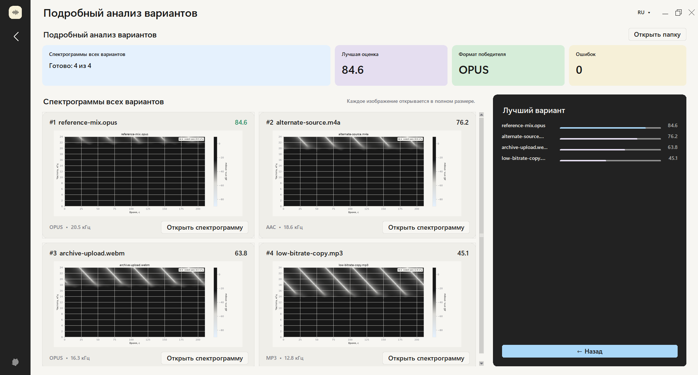
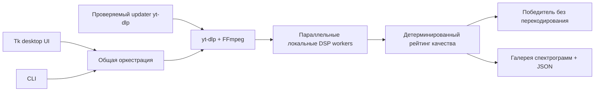

# TrackJudge

**TrackJudge локально сравнивает до пяти публикаций одного трека по спектру и сохраняет самый качественный источник без повторного кодирования, когда это возможно.**


[](https://github.com/emmzde/track-judge/releases/latest)
[](https://github.com/emmzde/track-judge/actions/workflows/ci.yml)
[](https://www.python.org/)
[](https://github.com/emmzde/track-judge/releases/latest)
[](LICENSE)

[English](README.md) · [**Русский**](README.ru.md)

## Как это выглядит в работе

TrackJudge не прячет доказательства за одной строкой с победителем: каждый вариант получает оценку, место, полезный спектральный срез и читаемую спектрограмму.



## Почему я это сделал

Я не мог нормально пользоваться обычными скачивалками: они часто выдавали пережатый звук, хотя мне нужен был Opus в максимальном доступном качестве. Потом я заметил, что один и тот же трек публикуют разные каналы и источники, и решил автоматизировать скачивание всех версий и само сравнение качества аудио.

## Ключевые возможности

- **Рейтинг на измеряемых признаках** — учитывает кодек, битрейт, спектральный срез STFT, структуру высоких частот и корреляцию стереоканалов, а не верит расширению файла.
- **Локальный и приватный анализ** — треки обрабатываются на компьютере; TrackJudge не отправляет аудио, отчёты или cookies браузера на собственный сервер.
- **Проверяем каждый вариант** — строит ранжированную галерею полноразмерных спектрограмм и при необходимости создаёт подробный JSON-отчёт.
- **Без лишней потери качества** — сохраняет победителя без повторного кодирования, если исходный формат это позволяет.
- **Устойчивое извлечение медиа** — обновляет `yt-dlp`, проверяет обновление и автоматически откатывается, если новая сборка перестала извлекать источник.

> TrackJudge использует детерминированные эвристики и не является криминалистическим доказательством происхождения аудио. Точнее всего сравнивать разные публикации одной записи и одного мастера.

## Технологический стек

| Слой | Технологии | Задача |
| --- | --- | --- |
| Десктопное приложение |   | DPI-aware интерфейс Windows, CLI, оркестрация и жизненный цикл |
| Обработка сигнала |   | STFT-анализ, спектральные измерения и корреляция |
| Визуальные доказательства |  | Спектрограммы в единой теме приложения |
| Работа с медиа |   | Выбор лучшего потока, probing, декодирование и remuxing |
| Доставка |   | Автономный portable ZIP и установщик Windows |

## Архитектура

GUI и CLI — тонкие точки входа поверх одного движка анализа. Загрузки идут последовательно, чтобы не провоцировать ограничения источников, а независимые DSP-задачи выполняются параллельно; затем единый детерминированный ranker выбирает победителя и формирует все артефакты для проверки.



## Установка / быстрый старт

### Установщик Windows

[Скачайте актуальный установщик TrackJudge](https://github.com/emmzde/track-judge/releases/latest/download/TrackJudge-Setup-Windows-x64.exe), запустите его и откройте приложение из меню «Пуск». Python, FFmpeg, FFprobe, `yt-dlp` и библиотеки анализа уже включены.

Также доступен [портативный ZIP](https://github.com/emmzde/track-judge/releases/latest/download/TrackJudge-Windows-x64.zip): он не изменяет `PATH` и не создаёт ярлыки. Неподписанная сборка может вызвать предупреждение Windows SmartScreen; SHA-256 приложены к каждому релизу.

### Запуск из исходного кода

```powershell
git clone https://github.com/emmzde/track-judge.git
cd track-judge
python -m venv .venv
.\.venv\Scripts\Activate.ps1
python -m pip install -e ".[dev]"
trackjudge-gui
```

При запуске из исходников FFmpeg и FFprobe должны быть доступны через `PATH`. Опциональный CLI описан в `trackjudge --help`.

### Проверка проекта

```powershell
ruff check .
ruff format --check .
pytest
```

## Roadmap / известные ограничения

- Оценка качества — детерминированная эвристика, а не доказательство происхождения мастера или истории кодирования.
- Онлайн-извлечение зависит от доступности источника и изменений антибот-защиты; управляемый updater снижает, но не устраняет этот риск.
- Готовая десктопная сборка сейчас ориентирована на Windows; движок анализа и CLI можно запускать из исходников на других платформах.
- Бинарные файлы Windows пока не подписаны, поэтому SmartScreen может показать предупреждение при первом запуске.

## Лицензия

TrackJudge распространяется по [лицензии MIT](LICENSE). Сторонние компоненты и их лицензии перечислены в [THIRD_PARTY_NOTICES.md](THIRD_PARTY_NOTICES.md).

Автор: [emmzde](https://github.com/emmzde).
